# 명언집 SNS

## 1. 📌 프로젝트 주제
react를 활용한 SNS 사이트 만들기

## 2. 💡 프로젝트 소개 (개발 기간 : 2025.11.25 ~ 2025.12.2 (1주간))
명언집 SNS는 여러분이 소중하게 생각하는 명언을 SNS 상에 올려서 다른 분들과 공유할 수 있는 사이트입니다.

각자가 소중하게 생각하는 명언을 공유하며 위로와 영감을 주고받는 서비스를 목표로 제작했습니다.

## 3. 🛠 사용 기술
| 분류 | 기술 |
|------|------|
| Frontend |  |
| Backend |   |
| Database |  |
| AI |  

## 4. 🖼️ 기획 및 설계

### 기획

  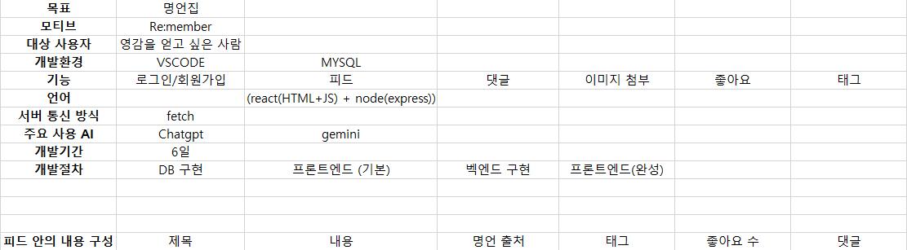

### DB설계

  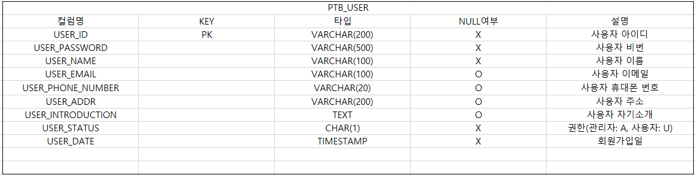

  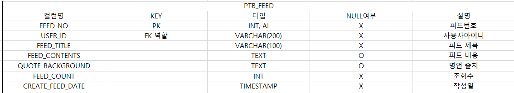

  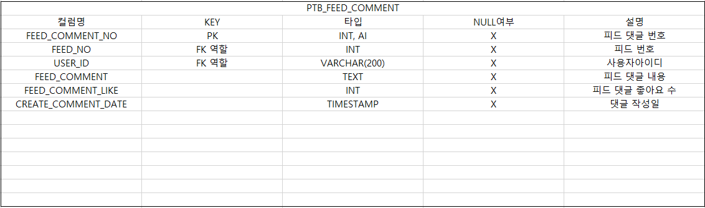

  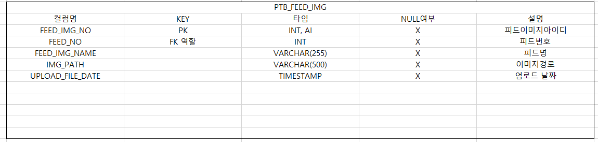

  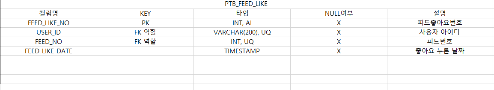

  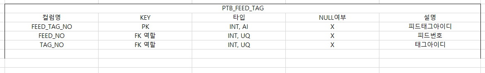

  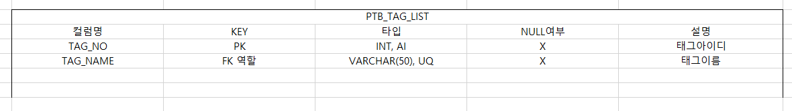

## 5. 📑 페이지별 주요 기능 

### 1. 로그인

- 아이디와 비밀번호가 MySQL DB에 저장된 고객정보와 일치하면 로그인
- 모든 사용자는 로그인을 해야 명언집 SNS 서비스를 사용할 수 있음
- 회원가입이 안되 있는 사용자를 위해 회원가입 버튼을 통해 회원가입 페이지로 바로 이동할 수 있음

  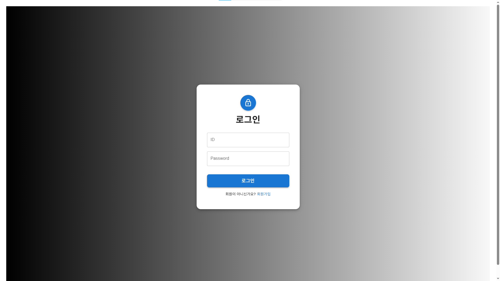

### 2. 회원가입

- 입력된 ID가 DB에 있는지 중복 확인을 해야 회원가입을 진행
- 이메일, 휴대폰 번호, 주소는 입력하지 않아도 회원가입이 가능
- 휴대폰 번호를 입력한다면 휴대폰 11자리를 입력해야 회원가입이 가능

  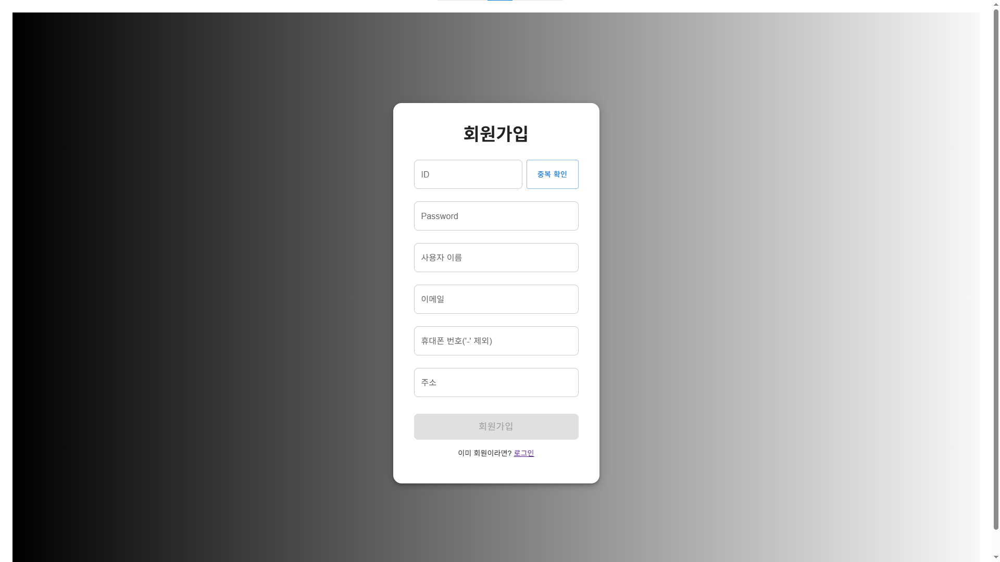

### 3. 전체 명언 & 나의 명언

- 사용자는 제목, 내용, 태그를 검색할 수 있음
- '좋아요 누르기'를 누르면 좋아요 기록이 생성되고 해당 버튼은 사라짐. 대신 '좋아요 취소' 버튼이 보여지고 이 버튼을 누르면 해당 좋아요 기록이 지워짐.
- 다양한 사용자들이 좋아요를 누른 총 횟수를 화면 상에 보여줌.
- 자신이 만든 피드는 삭제할 수 있음.
- 피드 이미지 출처: https://pixabay.com/ko/

  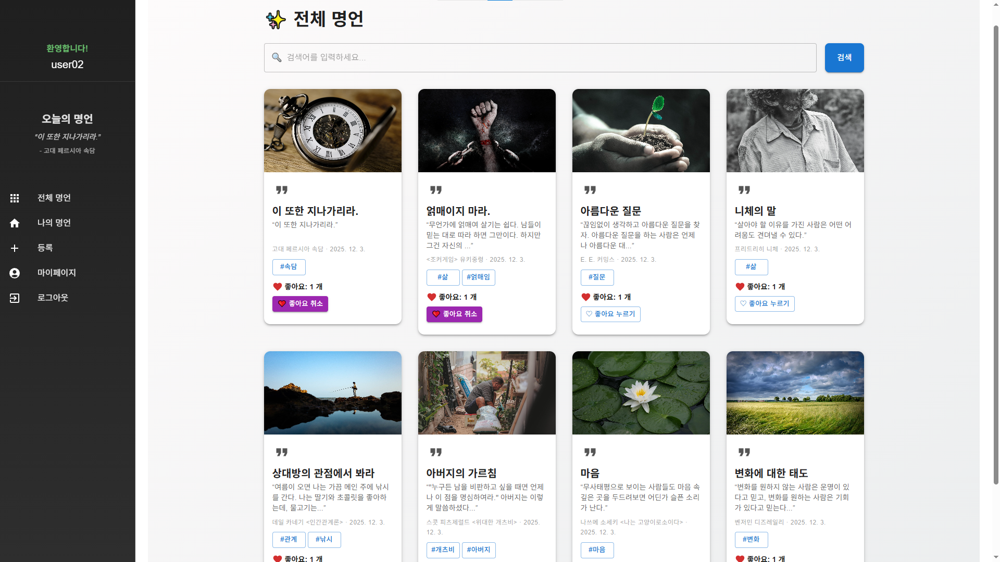

  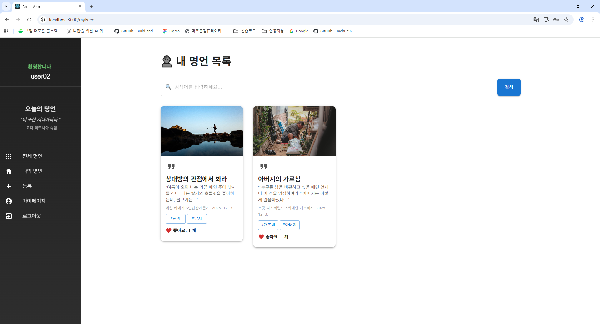

### 4. 상세보기(피드를 눌렀을 때 뜨는 모달 창)

- 제목과 전체 내용을 확인 가능
- 사용자들이 작성한 댓글을 확인할 수 있음
- 자신이 작성한 댓글은 삭제할 수 있음

  

### 5. 명언 등록

- 제목, 내용, 명언 출처, 태그를 입력있으면 피드에서 보여지는 이미지로 사용된다. 

  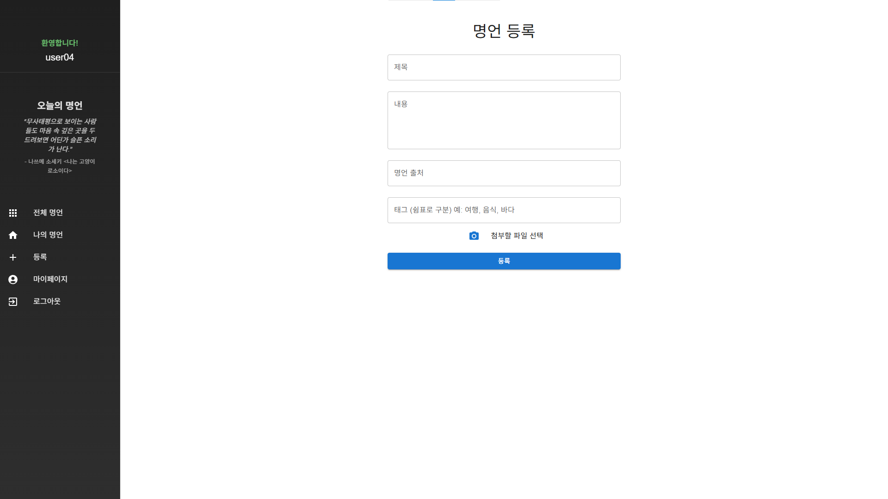

### 6. 마이페이지

- 로그인한 사용자 아이디와 이름, 작성한 게시글 총 수, 자기소개, 이메일, 전화번호, 주소를 확인하거나 수정할 수 있음
- 회원 탈퇴 버튼을 통해 회원탈퇴도 가능

  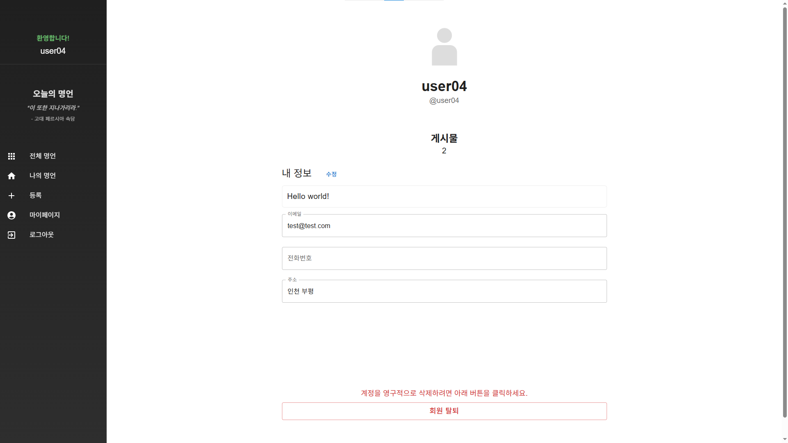

## 6. 🎇 프로젝트 후기

 명언집 SNS 프로젝트를 진행하며 React를 활용해 컴포넌트 단위로 UI를 설계하는 방식에 익숙해졌습니다. Express 기반 REST API를 직접 설계하면서 프론트엔드와 백엔드 간 데이터 흐름을 전반적으로 이해하게 되었습니다. 로그인, 게시글, 댓글, 좋아요 기능을 구현하는 과정에서 CRUD 전반을 직접 경험하며 실무에 가까운 개발 과정을 체득했습니다. 이 경험을 통해 단순히 기능이 동작하는 것보다 사용자 흐름을 고려한 설계가 더욱 중요하다는 점을 깨달았습니다. 또한 유지보수와 확장이 가능한 구조를 설계하는 것이 실제 서비스 관점에서 핵심이라는 점을 인식하게 되었습니다.
